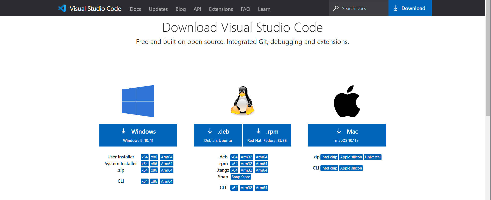
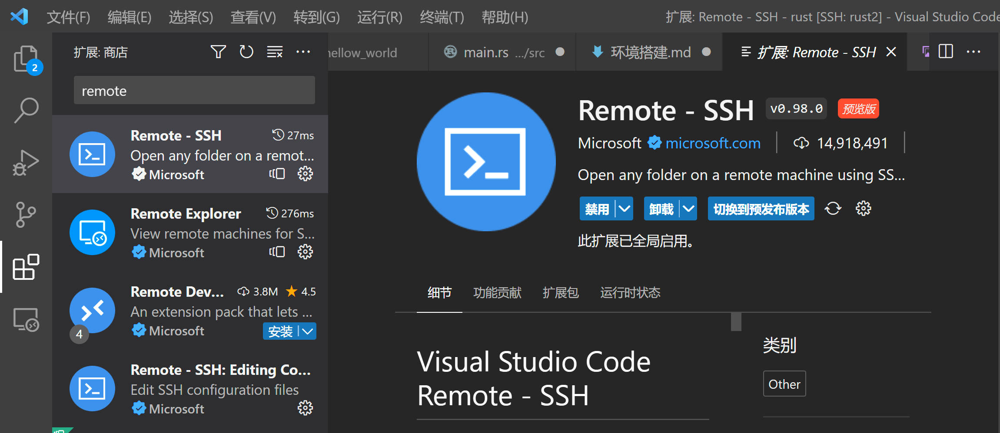
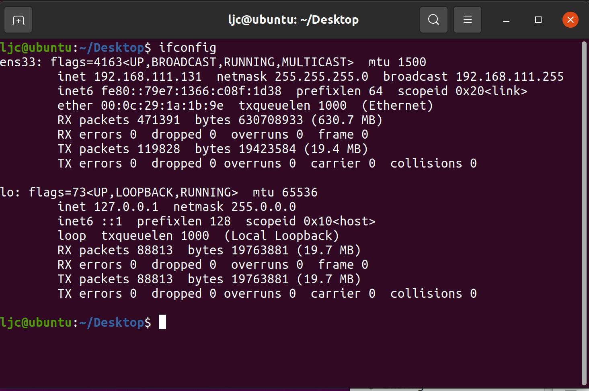
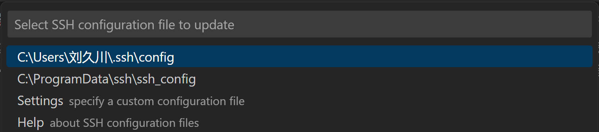
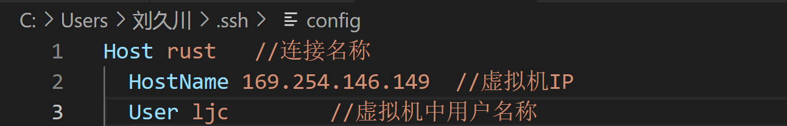

# vscode 使用ssh实现Linux下Rust编程的 环境搭建
## 1.VScode 安装
### 1.1下载 VScode[官方地址](https://code.visualstudio.com/Download"官方下载地址")

这里本机为windows 64位系统，选择对应版本安装即可
### 1.2下载 VScode Remote-ssh插件

在左侧拓展中搜索即可。
## 2.VMware安装

## 3.安装Ubuntu系统
### 3.1 下载镜像文件
### 3.2 加载linux.iso文件
### 3.3 下载rust安装需要工具
需要工具：gcc，curl；
打开终端，使用下列命令安装：
```
sudo apt-get install gcc
sudo apt-get install curl
```
### 3.4 rust安装
[参考网站](https://kaisery.github.io/trpl-zh-cn/ch01-01-installation.html)

打开终端，使用下列命令:
```
curl --proto '=https' --tlsv1.2 https://sh.rustup.rs -sSf | sh
```
如果安装成功，将会出现如下内容：
```
Rust is installed now. Great!
```
进行检查安装是否正确,打开终端，输入指令:
```
rustc --version
cargo --version
```
正确的话会出现版本号；
## 4.ssh连接
### 4.1虚拟机准备
需进行以下操作：<br>
1.安装ssh服务(Ubuntu可能自带)；<br>
```
sudo apt-get install ssh
```
2.安装network服务(用于使用ifconfig指令，查虚拟机ip地址);<br>
先执行ifconfig指令，看系统是否安装，若没有安装，则执行下列指令进行安装；
```

```
3.启用ssh服务；<br>
```
sudo services ssh start
```
4.查看虚拟机IP
```
ifconfig
```

可以发现ip为192.168.111.131<br>
### 4.2本机进行连接
打开VS code,左侧进入远程资源管理器，在SSH右边点击齿轮，上面config文件选择，选择第一个，如下图：

按照以下格式设置即可

##